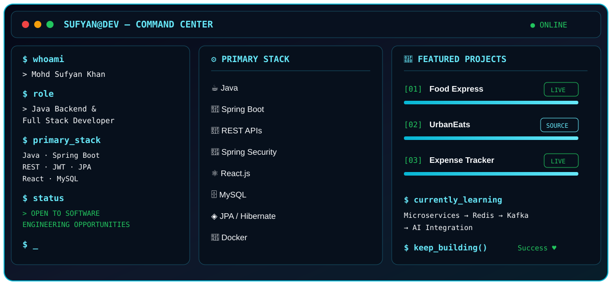

 

  

---

## 🖥️ Developer Command Center

---

## 👨‍💻 About Me

I'm a **Java Backend & Full Stack Developer** focused on building secure, scalable and maintainable applications using **Java, Spring Boot, REST APIs, Spring Security, JPA/Hibernate and React.js**.

My development experience spans traditional Java web applications using **JSP, Servlets and JDBC** as well as modern **Spring Boot REST architectures** with authentication, ORM, database persistence and deployment.

I enjoy understanding how applications work end-to-end — from HTTP requests and business logic to database persistence and frontend integration.

---

## 🎯 Recruiter Snapshot

| Backend | Security | Data | Frontend | DevOps |
|:---:|:---:|:---:|:---:|:---:|
| Java | Spring Security | MySQL | React.js | Git |
| Spring Boot | JWT | PostgreSQL | JavaScript | GitHub |
| REST APIs | RBAC | JPA / Hibernate | HTML / CSS | Docker |
| Spring MVC | Validation | JDBC | Redux | Postman |

---

# 🚀 Featured Projects

### 🍕 Food Express

**Spring Boot REST application focused on secure backend development.**

Built with a modern layered architecture using REST APIs, authentication, authorization and persistent database storage.

**Highlights**

- JWT-based authentication
- Spring Security integration
- Role-based authorization
- RESTful CRUD APIs
- JPA / Hibernate persistence
- MySQL database integration

**Tech:** `Java` `Spring Boot` `Spring Security` `JWT` `REST APIs` `Spring Data JPA` `Hibernate` `MySQL`

---

### 🍔 UrbanEats

**Java-based food delivery web application built with traditional Java web technologies.**

Designed around an MVC-oriented structure to understand request handling, sessions, CRUD operations and database connectivity.

**Highlights**

- User authentication and session management
- Restaurant and food management
- Order management
- CRUD operations
- JDBC-based database integration
- MVC architecture

**Tech:** `Java` `JSP` `Servlets` `JDBC` `MySQL` `HTML` `CSS`

---

### 💰 Expense & Savings Tracker

**Spring Boot application for managing expenses, budgets and savings through REST APIs.**

**Highlights**

- Expense management
- Budget tracking
- Savings management
- RESTful CRUD APIs
- JPA / Hibernate persistence
- MySQL integration

**Tech:** `Java` `Spring Boot` `REST APIs` `Spring Data JPA` `Hibernate` `MySQL`

---

# 🧠 Engineering Focus

| Engineering Area | Technologies |
|:---|:---|
| 🔐 **Security** | Spring Security • JWT • Role-Based Authorization |
| ⚡ **API Engineering** | REST • Spring MVC • API Design |
| 🗄️ **Persistence** | JDBC • JPA • Hibernate • SQL |
| 🏗️ **Architecture** | MVC • Layered Architecture • DTO Pattern |
| 🌐 **Web Development** | JSP • Servlets • Spring Boot • React |
| 🧪 **API Testing** | Postman • HTTP Methods • Status Codes |
| 🚀 **Deployment** | Docker • Render • Vercel |
| 🔧 **Version Control** | Git • GitHub |

---

# 🛠️ Technical Stack

### ☕ Backend

  

### ⚛️ Frontend

### 🗄️ Databases

### 🧰 Tools & DevOps

---

# 🔭 Currently Exploring

  

**Learning → Building → Deploying → Improving**

Exploring distributed systems and AI integration with Java.

---

# 📊 GitHub Analytics

  

---

# 🐍 Contribution Activity

---

# 🤝 Let's Connect

### Interested in Java Backend, Spring Boot & Full Stack Development?

I'm open to **software development opportunities, collaborations and interesting engineering projects.**

 

  

**Building today. Learning every day. Engineering for tomorrow.**

