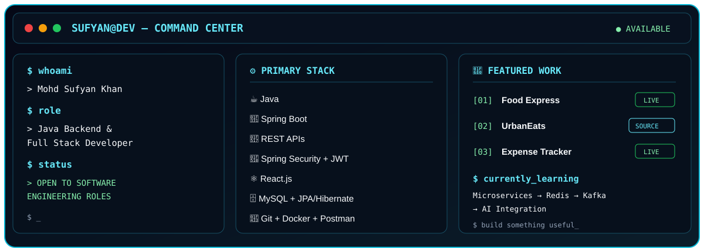
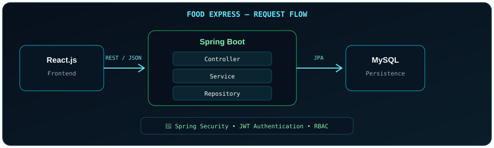

 

  

  

 

## 🖥️ Developer Command Center

## 👨‍💻 About Me

> I'm a **Java Backend & Full Stack Developer** focused on building secure, scalable and maintainable applications using **Java, Spring Boot, REST APIs, Spring Security, JPA/Hibernate and React.js**.
>
> I work across the application stack — from **JSP, Servlets and JDBC** to modern **Spring Boot REST APIs**, authentication, ORM, SQL databases and cloud deployment.
>
> I enjoy turning requirements into working software while keeping code structured, testable and maintainable.

 

## 🎯 Recruiter Snapshot

<table>
<tr>
<th align="center">🧩 Backend</th>
<th align="center">🔐 Security</th>
<th align="center">🗄️ Persistence</th>
<th align="center">⚛️ Frontend</th>
<th align="center">🔧 Tools</th>
</tr>
<tr>
<td>

- Java
- Spring Boot
- Spring MVC
- REST APIs

</td>
<td>

- Spring Security
- JWT
- RBAC
- Validation

</td>
<td>

- JPA / Hibernate
- JDBC
- MySQL / SQL
- PostgreSQL

</td>
<td>

- React.js
- JavaScript
- HTML / CSS
- Redux

</td>
<td>

- Git
- GitHub
- Docker
- Postman

</td>
</tr>
</table>

## 🚀 Featured Projects

 

<table width="100%">
<tr>
<td width="60%" valign="top">

### 🍕 Food Express

**Spring Boot REST application focused on secure backend development.**

Built with layered architecture, authentication, authorization, REST APIs and database persistence.

**Key Features**
- 🔑 JWT-based authentication
- 🛡️ Spring Security integration
- 🎭 Role-based authorization
- 🔗 RESTful CRUD APIs
- 🗃️ JPA / Hibernate persistence
- 🐬 MySQL database integration

`Java` `Spring Boot` `Spring Security` `JWT` `REST APIs` `Spring Data JPA` `Hibernate` `MySQL`

</td>
<td width="40%" valign="top">

</td>
</tr>
</table>

 

<table width="100%">
<tr>
<td width="100%" valign="top">

### 🍔 UrbanEats

**Java-based food delivery web application built with traditional Java web technologies.**

Designed around an MVC-oriented structure to understand request handling, sessions, CRUD operations and database connectivity.

**Key Features**
- 👤 User authentication and session management
- 🍽️ Restaurant and food management
- 📦 Order management
- 🔗 CRUD operations
- 🔌 JDBC-based database integration
- 🏗️ MVC architecture

`Java` `JSP` `Servlets` `JDBC` `MySQL` `HTML` `CSS`

</td>
</tr>
</table>

 

<table width="100%">
<tr>
<td width="100%" valign="top">

### 💰 Expense & Savings Tracker

**Spring Boot application for managing expenses, budgets and savings through REST APIs.**

**Key Features**
- 💸 Expense management
- 📊 Budget tracking
- 🏦 Savings management
- 🔗 RESTful CRUD APIs
- 🗃️ JPA / Hibernate persistence
- 🐬 MySQL integration

`Java` `Spring Boot` `REST APIs` `Spring Data JPA` `Hibernate` `MySQL`

</td>
</tr>
</table>

## 🧠 Engineering Focus

| Area | Technologies |
|:---|:---|
| 🔐 **Security** | Spring Security • JWT • Role-Based Authorization |
| ⚡ **API Engineering** | REST • Spring MVC • API Design |
| 🗄️ **Persistence** | JDBC • JPA • Hibernate • SQL |
| 🏗️ **Architecture** | MVC • Layered Architecture • DTO Pattern |
| 🌐 **Web Development** | JSP • Servlets • Spring Boot • React |
| 🧪 **API Testing** | Postman • HTTP Methods • Status Codes |
| 🚀 **Deployment** | Docker • Render • Vercel |
| 🔧 **Version Control** | Git • GitHub |

## 🛠️ Technical Stack

### ☕ Backend

  

### ⚛️ Frontend

### 🗄️ Databases

### 🧰 Tools & DevOps

## 🔭 Currently Exploring

  

`Learn` → `Build` → `Deploy` → `Improve`

## 📊 GitHub Analytics

  

  

## 🐍 Contribution Activity

## 🤝 Let's Connect

### Interested in Java Backend, Spring Boot & Full Stack Development?

I'm open to **software development opportunities, collaborations and interesting engineering projects.**

 

  

**Building today. Learning every day. Engineering for tomorrow.**

 

